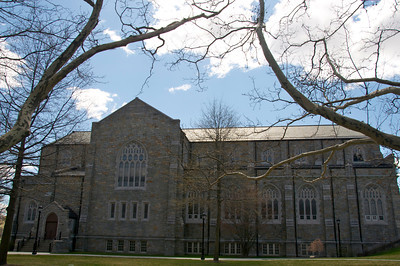
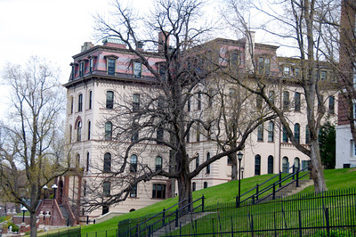
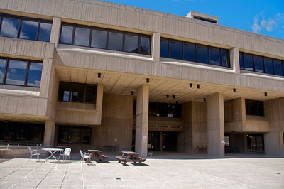
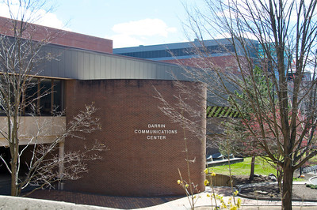

# An Unofficial RPI History of RPI

## A Short History Course

For a school a mere one hundred and sixty years old, RPI is soundly buried in historical events that seem uniquely peculiar to an engineering school. Those oddities obscured by time, error, or deliberate cover-up were the events sought after by Not the Handbook's staff of researchers. We wish to thank the Rensselaer Library's Archives Department for their assistance in our efforts. Their collection is, to no one's surprise, second to none on this subject.

### Amos Eaton

Amos Eaton was a major figure in the early part of RPI's growth as an Engineering School. The man, however, came into a good bit of trouble in his later years when he became connected with the corrupt land deals concerning the building of the Erie Canal.

Amos Eaton Hall was started as a project by president Ricketts in 1928 to build an auditorium large enough to hold the student body which was then around 1500. The actual costs of the building are unknown, as Ricketts contracted it along with the Caldwell dorms in the Quadrangle, but it has been estimated at $300,000.

### Russell Sage

Another notable character in Rensselaer's history was Russell Sage. Russell Sage's name appears on almost as many buildings as does Jonsson's. There is the Russell Sage Laboratory, the Russell Sage Dining Hall, and Russell Sage College in downtown Troy. As a matter of fact, most colleges in New York have at least one building named after him. However, the story behind these institutions is far more bizarre than meets the eye.

Russell Sage was never a student at RPI, and his influence and contributions toward the school while he was alive were small in scale when compared to what his second wife made. Sage was born the seventh child of a poor farming family from Connecticut. He first moved to Troy at the age of 13 to work at his older brother's grocery store. He soon became a little Horatio Alger in small trade and later in paper money options. By the time he was 24, he was a member of the Troy City Council, a bank director, and a money lender. He then married a pretty young woman, Maria-Henrie Winne, who was the daughter of a local lumber baron. They moved into a posh Washington Park home that Maria's father gave them. Russell became very interested in politics, and in 1844 became the city treasurer. From 1844 to 1849 he kept the city in the black with his judicious use of city funds. He then ran for Congress in 1850, but was defeated. This did not deter him, and in 1852 he was elected to the representative seat for Troy under the Whig party. It was at this point in his political career that his economic rise was to begin.

Sage's first big deal was over a railroad project that involved Erasmus Corning and other local political figures. He pushed through a project that involved the City of Troy buying a railroad from Sage for $700,000. This same railroad had recently been purchased by Sage for a mere $200,000. Sage quite openly bragged about his five hundred thousand dollar profit, justifying it by pointing out how much money Troy would save by owning the railroad. The scheme backfired, however, when Corning and others worked the railroad away from Troy.

After the deal in Troy, Sage went on to bigger things. He is responsible for most of the major railroad development in Minnesota from 1852 to the end of the nineteenth century. He was noted for being careful, and yet taking risks and profiting very well from them. It was at this period in his life that he moved from Troy to New York City and began to speculate on Wall Street.

On 7 May 1867, Sage's wife died of stomach cancer. After the funeral, Sage was a very solemn and depressed man. He devoted the rest of his life to the accumulation of money.

In 1869, Sage was involved, and later convicted, in a case concerning the Usury Laws in New York state. He was fined $500, but his jail sentence was suspended. He was accused of being the gang leader in a usury group. Later that year, Sage married his second wife, Olivia Slocum.

Olivia Slocum was a school teacher from Troy, who had attended the Troy Female Seminary, now known as Emma Willard School. She was forty-one when Sage married her, he was 53. The marriage was not out of love; Sage needed someone to call his wife so that he would not be the prey of "seduction lawsuits." There is no indication that Olivia and Russell ever really cared for each other, and it seems even less likely that they were ever intimate. Sage continued to have affairs with beautiful and exotic women until his later years, after which he settled down to doing his serious profiteering.

Sage was elected onto the Institute's board of Trustees on 24 June 1896. His only relative to attend RPI was a nephew, Russell Sage, Jr., who graduated in 1859.

Sage died in 1906, during a vacation that his doctor requested he take to get away from the business. Apparently the withdrawal killed him. His wife Olivia found herself with a $70 million estate almost overnight. She immediately established the Sage Foundation to aid in promoting social and educational causes. It was in this way that this school teacher from Troy, who was at the time the wealthiest woman in the US, began to make contributions to education. In particular, she fought for better women's education.

Olivia Slocum Sage made two large contributions to RPI. The first was funds for the building of the Russell Sage Laboratory, which was to house the new Mechanical and Electrical Engineering departments. At the time RPI was primarily a Civil Engineering school. When Palmer Ricketts, then President of RPI, sent her a letter suggesting the building of these departments, Olivia replied with a letter which said, in effect, "Good idea." To lend some weight to her letter, she also enclosed a check for $100,000. Eventually, the total sum donated for that purpose reached one million dollars.

The other major contribution came in the wake of a new addition to the Quadrangle dorms. During the planning for the White dorm extensions, Olivia Slocum wrote President Ricketts stating that she would offer $100,000 for the construction of a dining hall. This hall was to be named after her nephew, Russell Sage, Jr.

### Eric and Margaret Jonsson

Eric Jonsson, a dedicated Rensselaer alumnus of the class of 1922, and his wife Margaret, have done much to improve the appearance and facilities of RPI. Their first major contribution came in 1961 when they gave the school a gift which led to the construction of the Science Center, on a 20 acre site of land that the school had just purchased from the Catholic Seminary in 1958.

The next major gift to Rensselaer was $2,600,000 toward the construction of a new engineering center. The initial cost estimate for the building, as given to the New York State Dormitory Fund on 4 March 1975, was $11,808,100. While the Dormitory Fund did cover some of it, a 30 year bond was taken to cover most of the cost of the building. RPI intended to cover the bond with gifts, despite the annual payments of $202,000.

The actual groundbreaking was to be initiated by Margaret Jonsson; however, she was in Dallas, Texas at the time. A small charge was set up to be detonated by a phone call that Mrs. Jonsson made ... thus the term "dial-a-bomb" came to be the description of the event on 15 April 1975, at 11AM. The '86 Field became the "'43 Field," as construction equipment and much of the fill that was excavated for the basement of the Center (4000 cubic yards) was placed on the playing surface, cutting the field almost precisely in half down the long axis. The half of the field which was buried with fill became known as Mount Fogarty; it was two stories tall. The Jonsson Engineering Center opened in August 1977, and became a center piece of the "Rensselaer 2000" plan.

### Alan Voorhees

The Chapel became the school's second computer center, with the donations of Alan Voorhees and the insistence of RPI's students. In 1977 a study was completed detailing options for a new computer center, to replace the Amos Eaton facility and house the 'brand-new' IBM 3033 (see Myron in [Tute Speak](10-tute_speak.md)). The study was to choose among three plans. The first two proposals sought to build the center on top of or below the Armory Parking Lot. The third plan suggested renovating the Seminary Chapel, which was empty as of the opening of the Folsom Library. The Chapel was not favored by either the architecture group doing the study, nor by the Trustees, but a student referendum overwhelmingly chose the old church building as the site, remarking on the aesthetic beauty of the Chapel versus yet another "high-tech" edifice. According to students who were present at the time these decisions were being made, the student referendum did not really amount to a hill of beans; the item which tipped the scales in the favour of the Chapel as a computer center was that the estimated cost of the Armory computer center nearly doubled between the initial cost estimates and the final decision. With Alan Voorhees' $3.4 million gift (the largest single donation in RPI's history) the Voorhees Computing Center went under construction. The center opened on 9 Oct 1979.

The center is unique in that a small building was constructed inside the old chapel. To save energy costs, the heat generated by the computer within keeps the building warm in the winter. The new IBM 3081D computer now resides in the basement of the VCC. Unfortunately, the new machine does not produce the heat that the 3033 did, and people were worried about the possibility that they would have to install a real heating system in the computer center; however, it turned out that the IBX telephone system generates more heat on its own than the 3033 ever did. And since the IBX is housed in the VCC, heat is suddenly no problem. Of course, the air conditioning systems have had to be beefed up ...

### Libraries

Libraries at RPI have always taken a back burner to the more pressing needs of the research and education departments. The first Rensselaer Library was in the Main Building in downtown Troy, which was instituted in 1864. When the Main Building burned down in 1893, the library was moved to the Alumni Building. After the Pittsburgh Building was finished in 1912, it was chosen as the location of the new library. There the library remained until President Ricketts finished Amos Eaton Hall, in 1928, which became the Institute's fourth site for a library.

The Amos Eaton Hall served as a library until around 1961, when the Chapel and University Building were purchased by RPI. The Chapel was 'renovated', and in the place of pews went library shelves. By 1965, the Chapel was the main library. The Amos Eaton building became the Mathematics building, and housed the first real computing center at RPI. Here Fat Albert, Godot, Myron, and other, smaller, unnamed computers would later reside. The Chapel was a problem as a library, however, as its useful space was quickly filled with shelving.

By the early 1970s, a referendum was under way to increase library space on campus, as part of a national library drive on college campuses. It was during this turbulent period that the question of expanding the Chapel or building a new library, probably on the site of the University Building, came up. The Institute's president, Richard Folsom, was quoted in the Troy Record on *.* as having said, "the last thing this school needs is a new library ..." Despite this, a new building was commissioned in the early 1970s.

The Richard Gilman Folsom library was dedicated on 15 May 1976. It cost $6,900,000, holds 500,000 volumes, is composed of 10,000 cubic yards of concrete, and seats a maximum of 900 students. The library is named after the twelfth president of RPI; according to legend, it was so named as a final spit in the eye, since Folsom had kept the 'Tute from having a library for so long. The ground breaking ceremony was held in the spring of 1973. It is a fine library for a school that has traditionally shunned vaults for its texts.

## A History of Computing at RPI

[ This section was not written. ]

## Buildings which Move

Since you have been on this campus for a while, you have doubtless heard of the existence of several buildings which are, to quote the vernacular, "sliding down the hill into Troy." If you are like the average Tute student, however, you do not believe these stories at all. There are such buildings, however; what follows is a list of them, how they were discovered to be moving, and what, if anything, is being done about it.

### Walker Labs

Contrary to its name, Walker Lab is the only building on campus which is absolutely, positively, not moving. It is built on the only outcropping of bedrock which appeared on the entire lower campus, and is generally used as the reference point against which all other building movement is measured.

### West Hall

West Hall is built on a section of the hill which is, in fact, unstable. This was discovered many years ago, when Civil Engineers actually had lab classes in the use of the transit and other surveying instruments. Every two years, a class of juniors and seniors would go out and survey the campus. One year, a Civ. E. professor downgraded an entire section because they had measured West Hall as being six inches further down the hill than it had been two years before. The section protested, claiming that their measurements were accurate, and insisting that the professor check them for himself. The professor did this, and discovered that, in fact, West Hall was seven inches further down the hill than it had been two years earlier. Going back over earlier surveys, he also found that this represented a trend.

The professor did not, of course, change the grade that he gave the section. After all, they had still put the wrong position down on the map.

There is an engineering solution to every problem, and this one was no exception. The problem was, the land under the building was shifting, and there was not (and still isn't) any way to stop the earth from moving. So, long steel cables were run underground through tunnels and tied to the foundations of the Sage boiler room. Legend has it that there were originally four cables, and that only three remain, one of them having been cut through long ago by student dissidents.

### The Folsom Library

There were two blunders made when the Folsom Library was built. First, the building was originally designed with the floors bowed upwards, with the intent that the weight of the books would bow the floors back to level, and slightly stress the walls. The idea was that this would make the building as a whole more durable. Of course the construction crew didn't understand this concept, and the building was built with level floors, which are now bowed slightly downward with the weight of the books.

Next, another architect calculated the necessary capacity for the foundation without realizing that the building was a library. Because of this, no allowance was made for the weight of the books within the building. Books, as you probably know from carrying them to and from class, are heavy, with the result that the entire building is on its way into Troy. The land formation which the library was built on, however, is much more solid than the soil under West Hall, and it has been calculated that the library will be about due for replacement by the time that the subsidence starts causing trouble with awkward slopes on the plaza between it and the VCC. However, the one inch per year subsidence rate may cause the library elevator to become useless by 1986, due to the shaft going out of true.

### The Communications Center

The Communications Center was built on two different land masses. The 15th Street end is solidly on bed rock, and is not about to go anywhere; the end nearest the JEC is resting on an old river bed, and is slowly sinking into the mud. This is not instantly apparent, unless one looks in the tunnel between the JEC and the CC (which is available to anybody who knows how to get down to the first floor of either building). In this tunnel, there is an expansion joint, which was level when the tunnel was built. Needless to say, it is no longer level.

Again, the subsidence rate is minimal, and it will be many many years before the walkway to the JEC falls down. A much more worrisome problem to those of us in the CC is that the building may break in half, due to the uneven settling. Cracks are already appearing in the building, which will be aggravated by the construction of the CII; and doors in the CC have had to be rehung because of the doorframes changing shape.

As if the CC's cup of woe did not already run over, the 15th Street end of the building was built on top of an underground stream. This stream was not completely blocked off when the building was constructed, and still tries to flow into the place where the building is. This becomes evident in the air handler building just uphill from the CC, where the stream runs in and enters the air system, and on the first floor of the CC directly under the loading dock, which floods regularly every spring, despite the best (?) efforts of Physical Facilities.

### The 15th St. Lounge (the Playhouse)

The Playhouse was originally purchased from the U.S. Army, for the sum of one dollar. (Or so tradition has it.) The Army then moved it, at their own expense, by truck, from North Carolina, to put it in its present location. Since that time, it has not moved much; it has been renovated, but that did not entail moving it at all.

### The Hirsch Observatory

The Hirsch Observatory originally housed one medium-sized telescope which was used by the Astronomy Club for practice using the sort of equipment which existed in the real world (i.e. outside of RPI). When Generous Electric donated another, better telescope in 1982, a second dome was built to house it, since it was felt that the process of replacing the original telescope with the new one would cost more than simply building a new mounting system and putting the new telescope onto it.

The observatory immediately became known as the "Dolly Parton Observatory" for rather obvious reasons. As a matter of fact, as a prank, a group of students painted the tops of both domes red, added red plastic buckets to the structure, and then covered the entire thing with a "brassiere" made out of bed sheets.

The Observatory was on the site which was destined to become the New York State Center for Industrial Innovation (NYSCII, or just CII to us illiterate types), and so it had to be moved. Of course, this would jar the rather delicate mechanisms of the telescopes. So, it was decided to move only the dome containing the more recent of the two telescopes, the one donated by GE. This dome now lives on top of the Science Center.

### Most Other Campus Buildings

Most of the buildings on campus are, in fact, sinking into the mud. For instance, something went wrong with the footings for the Jonsson Engineering Center; a test footing was dug up during construction, and was found to have bulged out in all directions instead of continuing on down to bedrock as it had originally been intended to do. Because of this, there are twice as many footings as had originally been planned, which is the main reason why there are so many pillars in inconvenient places in the building. While it doesn't seem to have affected the building much, there are many who would say that a building the size of the JEC with the foundation which it seems to have would fall down in ten years. The building was built less than ten years ago; perhaps this prediction will turn out to be true. It is perhaps worthy of note that only 3/4 of the building ever got finished, and that architects called in to determine the feasibility of adding the missing 1/4 claimed that it couldn't be done.

Cogswell Labs are built on a normal, for RPI, land mass, and so will probably fall down at some time in the far future. There is gradual subsidence, and the walls are cracking; no structural damage has been done yet, but that says nothing for the future.

The Materials Research Center was built on two different land masses which are subsiding at different rates. The entire building was built with an expansion joint in the middle of it, and of course, the expansion joint has expanded. What more needs be said? The only thing which is keeping the building from breaking in half is that the architect designed it so that it would bend rather than breaking. Another story is that there is a law which states that a single building cannot be built from two different sources of federal funds, and the expansion joint is part of what makes the building into two legally separate buildings. Each half of the building does have a plaque stating that the building to which it is attached was provided through a different source. However, it is still true that the expansion joint has expanded.

The most stable buildings on campus are: the Quad, which is very small and light as buildings go, and is also built on bed rock; the Armory (or the Alumni Sports and Recreation Center), which was built by the Army, and so is ten or twelve times as strong as it needs to be; the Field House, which has no walls except the outside four, and so tends to not weigh down the earth very much; and the Freshman Dorms, Hall, Cary, Crockett, and Bray, which were built as ten-year temporary buildings some thirty years ago. Curiously enough, Nason and Warren Halls, which were built to the same pattern as 15 year temporary buildings sone 20 years ago, are beginning to fall apart; and Nugent, Davison, and Sharp Halls have been plagued with various troubles ever since they were built. These three dorms were, of course, built as permanent residence facilities.
