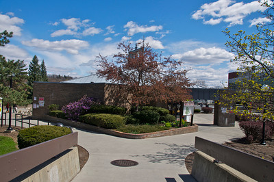

# Student Rights, Lefts, and Others

## Not the Student Bill of Rights

(This page inadvertently left blank)  

## Security

One of the least understood departments in the Administration is that of Campus Security. Located in the Visitor Information Center, Security holds a location central to most of the campus.

Security is basically hired security officers, employed by the Institute, with no more legal rights to enforce laws than any citizen. They are not allowed to carry weapons, and have not got the legal power that police do. However, the Institute has been actively trying to upgrade their power and authority for several years. Most of the actions have been blocked by Troy residents as well as the students at RPI, for fear of stronger control of the legal process by the school in regards to students.

Security does provide some useful services to students, such as help with recovery of stolen property and damage to personal belongings. They are constantly trying to make the campus aware of crime prevention techniques, and are actively working to make the campus safer to traverse at night, still a major problem for the women at RPI. Their response time, however, is a little weak, taking around ten minutes to respond to an on-campus call for assistance. Still, they are a little more friendly than the local police force, mostly because they are Tute employees.

## Computer Morals and Ethics at RPI

It is the policy of RPI to provide the best possible computing facility to the administration (and others too). It is also RPI policy to restrict the user. In order for these policies to be successful it is essential that the users themselves observe reasonable standards of behavior in the use of these facilities, as in any other aspect of their lives.

Computing at RPI has become a part of almost every student's academic life. This has resulted in a set of "Computer Ethics" which are more accurately termed "computer morals." _Not the Handbook_ has thoughtfully rewritten them so that the biblical significance may be better felt by the computer user.

### The Ten Commandments of ITS

1. Sybil is the computer thy mainframe and thou shalt have no computers before her.
2. Thou shalt not take the name of Sybil in vain, for Sybil shall remember, and shall not submit the projects of him that has.
3. Remember minimum priority, to keep it holy. For normal priority is the sabbath of the administration, in it thou shalt do no work.
4. Thou shalt not read nor use the private files of others, neither change nor delete them.
5. Thou shalt not use an account for purposes other than that for which its funds are allocated.
6. There is no number six.
7. Thou shalt not violate property rights nor copyrights in data nor computer programs.
8. Thou shalt not modify software components nor operating systems, nor compilers, nor utility routines, nor etc.
9. Thou shalt not attempt to modify computer equipment nor peripherals.
10. Thou shalt not covet thy neighbour's account, neither shalt thou covet his password, nor his disk pages, nor his files nor his access, nor anything that is thy neighbour's.
