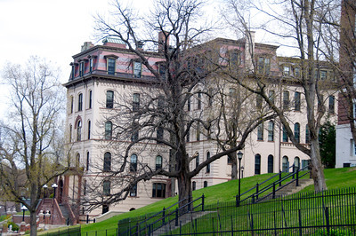

# Classroom Facilities

Those of you who have actually attended classes at RPI, whoever you might be, have actually seen the inside of several of the more famous buildings mentioned earlier. For the benefit of those of you who never made it to class, or who are eagerly awaiting your first class at RPI, here is a description of most of the classroom facilities available to you as students. We will start at the bottom of the campus, and work our way up to the start of the Ho Chi Minh Trail, as you will probably do after your first class in West Hall.

## West Hall

West Hall consists of two pieces, the old building and the new wing. Both of these have been heavily modified over the years. There are two entrances to the building. The one which looks like a loading dock off the parking lot actually is a loading dock; it enters the new wing on the (you guessed it) third floor. The entrance closer to the Pittsburgh building ends up at a point midway between the second and third floors of the old building.

Most of the classes which you will take in West Hall will be humanities. Languages, literature, and communications all have their homes in this building, and most classes in these courses occur in the small rooms on the fourth floor. Note that the new wing does not have a fourth floor; all these rooms are in the old building. Some literature classes are held in the classrooms on the second floor, but not many of them.

All of these classrooms have one thing in common: the desks. You will be required to sit in silly little desks with very hard seats and miniscule note-taking surfaces, usually for an hour and a half at a stretch. The desks will have graffiti all over them just before each long vacation, which will vanish again by the time classes re-convene. This is because the writing surfaces of these desks are made of the least markable compounds known to man: RPI hyperplastic. This strange yellow substance can be found nowhere else in the known universe.

If you are a geologist, you will discover the rock rooms, on the first floor, down under the auditorium. The Geology Department lives down here, and has offices, a museum, and work-study jobs down in these subterranean burrows.

The only other classroom in West Hall that you will ever see as an undergraduate is the auditorium. This room, which is designed to seat 800, is most commonly used for tests, and very large classes (such as Physics) when CC 308 and Sage Lecture Hall are already in use. Due to the extreme age and decrepitude of the room, however, only about 650 seats are still useable. There are two different types of seating in the Auditorium (or WHAud as it will appear on your schedule). The center section at the front of the room has been rebuilt in the last four years, and has black vinyl seats which make your bottom very sweaty in the summer, and tiny little writing desks which fold out from the chair arms. The rest of the auditorium is furnished with green vinyl seats which are a little easier to sit on in the summer, and writing desks with a fair amount of surface area which fold out from the seat back in front. These desks are much better than the new ones for taking tests, since there is a large amount of surface area for calculators, crib sheets, spare pencils or (if you are a masochist) pens, erasers, and munchies. Unfortunately, all of these seats were installed N years ago, and have not been overhauled since. Many of the desks are broken, so get there early and get one of the working ones, when you take a test in that room.

## The Carnegie Building

The Carnegie Building is another of the favorite haunts of the various Humanities and Social Science schools; the Psychology Department lives there, as does the Economics Department, and sundry others. Classrooms exist on the first and second floors, and there are a few animal experimentation labs in the basement. The science and engineering departments have pretty much reserved the best rooms, down on the first floor, and Psychology and other social sciences pretty well have to live with the rooms on the second floor. Of course, these rooms are a long climb above the level where the doors are, which (surprisingly enough) is the first floor. The major characteristics of all the rooms in the building are: blackboards completely surrounding the room, creaky and splintery wooden floors, and standard issue Tute desks with hyperplastic writing surfaces.

The basement, where some psychology courses (notably Sensation and Perception) have lab classes, are very different. The tables are covered with metal, and have little ridges along the edges; this is intended to make them more useful for experiments involving dissection. The main thing that this means to the student is that there will be no place where it is safe to rest his arms during class, and no real way to take notes or tests. The basement is also pretty well equipped with Roach Motels; we will let you draw whatever conclusions you like from that.

One of the most interesting features of the Carnegie Building is that it has no rest rooms. Yes, they are there, all of the campus buildings have them, but in Carnegie, they are all locked, available only to the people who work in the offices. If you suddenly "feel the urge," as it is sometimes called, and you are in Carnegie, you lose.

## The Walker Labs

The Walker Labs are used primarily as a place to give freshman their first exposure to the perils of the Chem Lab. The entire first floor of the building is a large lab area, which is set up to allow all the Chem I and II students to do their experiments at the same time. (Well, actually, you take turns, but you all seem to be there at once, anyway.) There is more lab space in the basement, but you will never see that unless you are a chemist.

Up above the lab area, at the end of a twisty little staircase, there is a set of three classrooms separated by rather flimsy dividers. These classrooms are used to teach Chem students what they are supposed to be doing in the labs which they are busy messing up on the floor below. These rooms are fully equipped with hyperplastic desks, and even have overhead projectors, sometimes. They are occasionally used as overflow classrooms, when everything else is full. Officially, these three classrooms are now listed as a single classroom, which is just as well, since they were originally intended to be just one room; this room is known as WA 303. This is very good room to have classes in, if you can deal with the stairs; when it rains (which is almost all the time, in Troy), not only is the sound of rain on the copper roof just over your head very soothing, it also completely drowns out the lecturer.

These small classrooms are officially listed as being on the third floor; on the second floor, there is a room which is designed to be a lab, but which now serves as an auxiliary classroom. This room has been taken off the Registrar's list of classrooms, which is lucky for you because it isn't really very much of a classroom. You will see it only once, probably, during the second half of Chem I, when you will be required to work on the mathematical section of your last lab.

The stairs all through the building are small and twisty. There is an elevator hidden in the back of the building, which the Administration does not want anybody to use. The staff of _Not the Rensselaer Handbook_ fully agree with the administration on this point; this elevator is so old as to be actively unsafe. The support ropes have not been inspected in years. Yes, that's ropes. Not cables. This elevator is one of the first Otis ever built.

## Amos Eaton

The Amos Eaton building is one of the oldest buildings on campus. It has served as a library, and as a computer center; it currently serves as the home of most of the miscellaneous administrative services of the Tute, the Math and Computer Science departments, the ACM, and the Minicomputer Lab.

Let us look at two typical classrooms in Amos Eaton: AM 214 and AM 215. Logically enough, these are both on the second floor. Both of these rooms feature grey polyethylene chairs which are reasonable to sit on, but cause excessive sweating after an hour or so. AM 214 can be entered from the stairwell, or from the far hall; it contains a set of separate chairs with large, swing-up desks. These desks are again, ideal for taking tests; there is lots of room there for anything you care to bring with you. AM 215 can be entered only from the hall, and has long tables with free-floating chairs behind them. Both rooms are light on the audio-visual equipment.

On occasion, you will have to go and see a professor who has offices in the building. Generally, his offices will be on the fourth floor. If you look at Amos Eaton from the outside, you can see that it has only three stories. However, once you are inside, you can actually find large numbers of offices on the fourth floor, and they really exist, and they even have windows, just like the offices on the first, second, and third floors. This is one of the great mysteries of life here at the Tute: Where does the 4th floor of Amos Eaton really exist? The staff of _Not the Rensselaer Handbook_ feel that the answer to this question is either Oz, Boston, or a small planet orbiting Betelgeuse.

Anyway. The main reason that Amos Eaton is so well populated is that it has a very large number of terminals for accessing Sybil. On the first and second floors, there are terminal rooms which are filled with random people talking to Sybil and hating every minute of it. These terminal rooms are good, because they are very heavy on the 3270-type terminals, and very bad because (a) everybody and their brothers knows about them, so that you will have to wait a long time for a terminal, and (b) the chairs are very plastic-like and non-porous, so that you sweat there both summer and winter.

## Russell Sage Labs

The Russell Sage Labs have just been rebuilt, because they were pretty much falling apart inside. Now, the inside is a mixture of Modern Hideous and Archaic Leftover, somewhat indiscriminately mixed together. If you have any artistic sense at all, you will probably be appalled at the mess called "interior design" in this building. One of the more hideous creations fills a certain amount of empty space on the fourth floor; it consists of an entire model house, including windows and doors.

The Lecture Hall has been renovated; it is now very much heavier on the audio-visual equipment than it ever was before, and it also now has real seats. The desks are still miniscule, making this not a very good room to take tests in; and the roof leaks in places, making rainy day classes very much a game of Aqua Roulette.

The lecture hall at the end of the hall to your right as you enter the building has also been renovated. This room has some long official number, like SA 3510 (and yes, the ground floor of the Sage Building is the third floor). This room has comfortable seats and moderately sized swing-up desks. The front of the room is on the third floor of Sage Labs, and the back of the room is just above the third floor of the Sage Annex. This causes a certain amount of problems with the numbering of rooms, but this doesn't bother the Administration. So, why should it bother the students? Also, this creates a certain amount of trouble when people decide that the quickest way from their class in the Lecture Hall to their class in Sage Annex is through this room, and class is still being held. (But at least it breaks up the monotony.)

## The Greene Building

Although the Greene building is primarily an architect's hangout, there are a few classrooms here which the average engineer can occasionally get into. These are generally used for engineering classes and the occasional humanity or social science. The method used to number the doors of the Greene Building seems to bear no relation to life in the universe as we know it. As a good first approximation, find the floor the room is supposed to be on, and then turn right. Most of the classrooms seem to be to the right of the main entrance, which is midway between the first and second floors.

Again, the main thing which you will find here are desks made of hyperplastic. The floors are splintery and unfinished; the walls are severely in need of paint; ceilings are high and tend to cause echoes.

### The Troy Building

Conditions in the Troy building vary widely from room to room. In general, rooms on the first floor are designed with your comfort in mind, where rooms on the second floor are designed to keep you awake in class, and those on the third floor are designed to give the class a bit of comic relief when you fall off your stool and onto the floor. Let us look at a typical room on each floor.

Troy 101 is a fairly large hall, seating about 115. This room has soft seats, and small desks which hinge up from the seat arms. There are a couple of overheads in this room, and very little else. There are two windows in the back of the room which shed very little light into the room, and have not been opened in living memory.

Troy 203 has a very interesting alternative to seating. Imagine, if you will, a park bench with a desktop bolted to it every two feet. This is what you will be sitting on if you attend classes on the second floor of the Troy building. The gap between the desks is only just wide enough to allow you to sit down, and the desk itself is smaller than any other desk in the Tute. Also, since the chair is made of slats, the longer the class, the more agony you are in from the things cutting into your back. As if this weren't enough, since the seats are all joined together, any time anyone on this bench twitches, you feel it. The room is equipped with the bare minimum of audiovisual equipment, a blackboard. Life in this room will be very tiresome after only a very few classes.

Troy 301 is a set of high lab benches, equipped with very high stools and very little else. This room is usually used for recitations, rather than for actual classes; most of what you will be doing here will be brain work. I had always thought that the way to get the brain working was to make the body comfortable so that the brain didn't have to pay it any attention, but these rooms were not designed with that philosophy in mind. You will find that you will spend rather a lot of time on your feet in this classroom, trying to stretch out the kinks in your back. This condition is helped by the fact that the desks are all at the wrong height for the stools, or is that the other way around? Anyway, this is a very uncomfortable place to work.

One important fact to note about the Troy Building: like the Carnegie Building, all of the rest rooms are locked away where you can't get at them, and are reserved for the use of the people who work in the offices there.

### The Jonsson Engineering Center

  
\[ This section was not written. \]

### The Ricketts Building

The Ricketts building is one of the few buildings on campus which could be called split-level. There are no real floors as such; instead, there are half-floors. For most of the building, the area to the left of the central stairwell, and to the right, are at different levels. The front door opens on the so-called first floor; however, this seems to bear very little relationship to the room numbering scheme. The only way to find your way to your classroom is by trial and error.

Some of the building has been modernized; most has not. The park benches with desks bolted onto them appear here and there throughout the building, primarily in the larger rooms. These seating arrangements are no better than the ones in the Troy building. Other rooms are rebuilt, and have reasonable desks, usually covered with white Formica, which are very nice for taking tests.

### The Communications Center

The Communications Center was originally called the Modern Classroom Facility. It was designed to be a model of what classrooms should be like, and still almost fits the bill. There are three types of classrooms in the building: large, small, and bizarre.

The large classrooms are CC 308, 318, 324, and 330. These are all outfitted with lots of very bright lights, fairly large stage areas for demonstrations, a railing at the bottom to protect the lecturer, and huge amounts of audio-visual equipment. Or rather, they were supposed to be outfitted with huge amounts of audio-visual gear, but they weren't. The story behind that is as follows: Clay P. Bedford, after whom CC308 is officially named, donated enough money to equip CC308 with A/V gear. The Tute said, "Thank you very much," and started looking around for more donors to outfit the rest of the CC. However, none were forthcoming. So, half of the A/V gear which had already been installed in CC308 was ripped out, and spread around the rest of the CC. This provided barely enough equipment for all the rooms other than CC308. The Administration does not want to remove any more equipment from 308, because it is their showcase classroom.

The desks are all bright yellow plastic bucket seats, which are individually bolted to the floor, and have large swing-up desk surfaces. There are projection booths at the back of the rooms to allow films, slides, and anything else to be shown to the gathered populace. There are, of course, no windows.

The small classrooms are down on the second floor. These rooms all started out having desks that were modeled after the ones in the large classrooms, with comfortable (albeit sweaty) seats and large writing surfaces. However, these did not last, and have been largely replaced by the standard-issue Tute desk, which has a much smaller writing surface. These rooms are small enough to be useful, and so are not very highly regarded by the Administration; they are outfitted with the bare minimum of A/V gear. Every pair of these rooms shares a single projection booth which has in many cases been set aside and converted to offices or laboratories for our less-distinguished professors.

There is only one of the bizarre classrooms in the building: CC 337, or the "case study room," as the building plans call it. This room is set up as a large number of chairs gathered around a semi-circular stage, and arrayed so that up to 116 students can peer down at whoever or whatever is displayed on the stage. This tends to make professors nervous. In any event, this room is one of the better ones to have classes in. The chairs are arrayed behind long tables, thus allowing simply incredible amounts of desktop space for each student. The chairs recline and swivel, giving the student something to do to take his mind off the bletchfulness of the class. (Don't laugh, you'll find yourself doing it, too.) The chairs are very comfortable: it seems that, since they recline, they had to be made stronger than the other chairs in the CC. The material these chairs are made out of seems to be much more porous than any other chairs on the entire campus.

What this all boils down to is that, generally, the CC is, as it was designed to be, the best place to have classes on the entire campus. And CC 337 is better than any other room in the CC.
