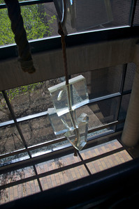

# The Chapter of Lists

How could this silliness be summarized better than by a chapter devoted to the most useful form of data organization, the list? These pages that follow contain the most obscure yet useful information available on RPI in a compact form that any non-Computer Science major can deal with (CompSci-types, just think in terms of LISP and things will work out).

## What to Take to an Exam

### A writing instrument

Try pencils, pens, crayons, or even spray paint cans, but avoid anything which can't be erased quickly. Ignore this condition if you are a crosser-outer.

### A calculating machine

A simple four function (yes, they still make them) device is fine, although nothing feels quite as good as an HP-41CX in the palm. Maybe bring two.

### Back-up power for the calculator

Items like spare Duracells or even portable electric generators work well.

### Crib Sheet

This can be loosely identified as notes for an "open book" test, but we advise against carrying into a test any textbook unless the course is Assembler, in which case the description of the entire IBM 360/70 instruction set might be slightly useful. If it's for a course like Physics I, bring a magnifying glass so you can read what you microprinted the night before.

### A Picture of an Authoritative Intellectual

Our personal favorite is one of Albert Einstein, but a good profile of Max Planck will do wonders to confuse the TA's minds. The photo is basically a simple method to ensure that a great mind is overlooking your exam.

### Stuffed Animal

Nothing soothes the savage test-taker like a warm fuzzie. Your friendly bear, penguin or tribble will work well.

### Nourishment

Brain food aside, a cold soda and munchies help take your mind off of test-death. Long-lasting lollipops work very well and don't disturb your fellow sufferers.

### Small Portable TA

This works best on tests that are open book, and the instructor has foolishly acknowledged that "anything you can carry into the test, you can use." A real fight starter. After all, your peers will all want to borrow your TA.

### Drugs

While _NtRH_ doesn't advocate these, if you went to every lecture and recitation drunk or stoned, and did the homework and readings in the same state, it follows that you cannot perform on the exams unless you are in your common state of mind for the course. \\item \[Some Idea of How to Answer the Questions.\] This one seems almost _too_ obvious, but it is often overlooked as being too difficult, since it requires going to class, studying, doing the homework, etc. And ALWAYS make sure you know exactly what course the exam is for -- studying Physics for a Calculus test renders much of the knowledge you accumulated the night before useless.

## Reasons to Skip Class

1. The class is before noon.
2. Can't solve differential equations in my head.
3. Didn't do the class assignment and don't like to attend class unprepared.
4. The instructor knows no American English.
5. The class is in West Hall.
6. There is two feet of snow on the ground and you assume that class will be cancelled anyway.
7. GM Week.
8. Your girl/boyfriend is in town for the day.
9. You just took a test (or had one anytime that day).
10. The textbook weighs more than your refrigerator.

## The Silliest Artwork on Campus

### The Plastic Blocks on Rope

In the 2nd and 3rd floors of the JEC, this winner takes the biscuit. A few years ago, it was joined by an old clothes washer on a cable.

### Tank Treads

By the Folsom Library, on Hill St. Helen's, you can't miss them. They used to be right on top of the steam vent, but they got moved because they were getting rusty.

### Brick Fountain

Just off the JEC west ramp, this circular pyramid was designed to be a fountain, but funds ran out and so did the water.

### Cowbells

On the cliff overlooking the Walker Lab.

### The New Playhouse

Even the Players don't like the new look of their art-deco "barn."

### Hudson River Fountain

On the third floor of the Folsom Library, this huge set of cylinders was donated by Eric and Margaret Jonsson. When it is actually running, it's rather amusing to watch, but annoying if you are trying to study.

### The Sage Laboratory Renovations

Talk about clash!

## Centers at RPI

1. Communications Center (CC).
2. The Center for Integrated Computer Graphics (CICG).
3. Center for Manufacturing Productivity and Technology Transfer.
4. Graduate and Married Student Center.
5. The Writing Center.
6. Voorhees Computing Center (VCC).
7. Information and Personal Assistance Center (IPAC).
8. RPI Daycare Center.
9. Center for Industrial Innovation (CII).
10. Performing Arts Center (Playhouse).
11. Materials Research Center (MRC).
12. Jonsson Engineering Center (EC officially, JEC normally).
13. Science Center (SC).
14. Learning Center.
15. Visitor's Information Center (VIC).
16. Center for Integrated Electronics (CIE).
17. University Information Center.
18. Chapel and Cultural Center (C & CC).
19. Ecological Modeling Center.
20. Human Dimensions and Technology Center.
21. Introductory Management Engineering Center.
22. Alumni Recreation and Sports Center (AR & SC).
23. Lally Management Center.
24. Urban and Environmental Studies Center.
25. Cancer Development Center.
26. Counseling Center.
27. Black Cultural Studies Center.
28. TIME Support Center.
29. Bearing Testing (and Torture) Center.
30. Center for Architectural Research.
31. Center for Electric Power Engineering.
32. Residence Life Community Center.

## The Ten Best Yerazunis Jokes

1. How many Yerazunises does it take to screw in a lightbulb? Two. One to operate the cherry-picker, and one to arc-weld the new bulb in place. No, three. One to drive the forklift, one to jackhammer the old bulb out and one to arc-weld the new one in.
2. What kind of underwear does a Yerazunis wear? Sears Craftsman Best.
3. How does a Yerazunis cook a lobster? In a pot with an oxy-acetylene torch.
4. What does he do afterward? Weld the hole in the pot.
5. What does a Yerazunis use for a personal radio intercom? Westar VI. (Nobody else knows where it went.)
6. Why did the Yerazunis cross the road? He was welded to a chicken.
7. What keeps Yerazunis's waterbed warm? Heavy water? No, Three Mile Island.
8. Q: Is there any coconut in them? A: No, it's all solid state.
9. What instruments are on a Yerazunis dashboard? A speedometer, tachometer and of course a gyrocompass.
10. What does a Yerazunis use to toss the salad? An F-14 turbine engine.
